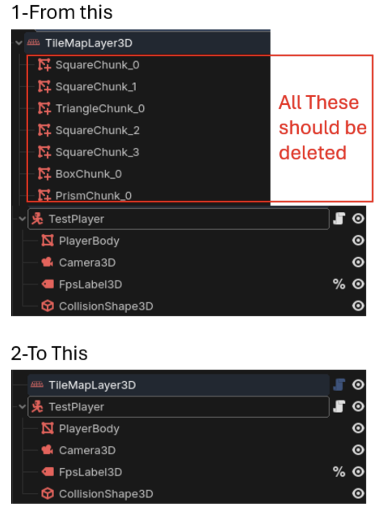

## TileMapLayer3D 🧩

**Version 0.4.0** - Major update with 3D mesh modes, SpriteMesh integration, and optimized storage.

Godot 4.5+ editor plugin for building 3D tile-based levels from 2D tilesheets. Heavily inspired by Crocotile3D but built directly into Godot.

 

## Want to support me?

or via GitHub: [Sponsor DanTrz](https://github.com/sponsors/DanTrz)

---

## Tutorial and Auto-Tiling Setup Video

## 🎯 Why I created this?

To help with creating old-school 3D Pixel art style games, or to leverage 2D tiles for fast level prototyping. 
You can create entire levels, or you can create reusable objects and assets using a Grid-based structure that offers perfect tiling. 
---

## ✨ Features

### Core Features
- ✅ **Paint 3D levels from 2D tilesheets** — Import any tilesheet, select tiles, click to place
- ✅ **Multi-tile selection** — Select up to 48 tiles and place them as a group
- ✅ **18 orientations** — Floor, walls, ceiling + 45° tilted variants for ramps and slopes
- ✅ **Transform on the fly** — Rotate (Q/E), tilt (R), flip (F), reset (T)
- ✅ **Area painting & erasing** — Shift+Drag to paint/erase rectangular regions
- ✅ **Full undo/redo** — Every action reversible via Godot Editor

### New in v0.4.0
- ✅ **BOX & PRISM mesh modes** — Create 3D tiles with depth, not just flat quads
- ✅ **Per-tile depth control** — Adjust thickness of BOX/PRISM tiles (0.1 to 1.0)
- ✅ **Texture Repeat Mode** — Tile textures across BOX/PRISM depth surfaces
- ✅ **SpriteMesh generation** — Convert tile selections into standalone 3D mesh objects (original project https://github.com/98teg/SpriteMesh)
- ✅ **Flat tiles Backface painting** — Paint double-sided walls for interior/exterior rooms
- ✅ **Autotiling (Enhanced)** — Uses Godot's native TileSet for terrain painting
- ✅ **Optimized storage** — ~47% smaller scene files with automatic migration and external collision resource file save
- ✅ **Spatial chunking** — Better performance and dual chunck system for MultiMeshInstance3D (works by distance and total instance count)

### Export & Collision
- ✅ **Collision generation** — Automatic collision geometry for all mesh types
- ✅ **Binary collision export** — Save as .res for smaller files
- ✅ **Mesh baking** — Combine tiles into a single mesh for export
- ✅ **Scene persistence** — Close and reopen, tiles are still there

---

## 🧱 Mesh Modes

TileMapLayer3D supports four mesh types for different use cases:

| Mode | Description | Best For |
|------|-------------|----------|
| **FLAT_SQUARE** | Traditional flat quad tile | Floors, walls, ceilings |
| **FLAT_TRIANGLE** | Flat triangular tile | Angled corners, slopes |
| **BOX_MESH** | 3D cube with configurable depth | Thick walls, platforms, blocks |
| **PRISM_MESH** | 3D triangular prism with depth | Ramps, wedges, angled structures |

**Depth Control:** BOX and PRISM meshes have adjustable depth (0.1 to 1.0) for creating walls of varying thickness.

**Texture Repeat:** Enable "Repeat Mode" on BOX/PRISM to tile the texture across the depth surface instead of stretching. (Option in Tab "Other" settings)

---

## 🚀 Quick Start

### Step 1: Enable the Plugin
1. Open your Godot 4.5+ project
2. Go to `Project → Project Settings → Plugins`
3. Find **"TileMapLayer3D"** and enable it
4. The **TilePlacer panel** appears in the left dock

### Step 2: Create Your Scene
1. Create a new 3D scene with a **Node3D** root
2. Add a **TileMapLayer3D** node
3. Select the TileMapLayer3D node (required for the plugin to work)

### Step 3: Load Your Tileset
1. In the **TilePlacer panel**, click **"Load Tileset"**
2. Select your tilesheet image (works best with 48x48 tiles or smaller)
3. Set **Tile Size** (e.g., 32 pixels)
4. Keep other settings at defaults to start

### Step 4: Select and Paint
1. Click a tile in the TilePlacer panel (yellow highlight = selected)
2. Click **"Enable Tiling"** button in the 3D viewport
3. You'll see a 3D grid cursor with colored axes (Red=X, Green=Y, Blue=Z)
4. **Left-click** to place tiles at the cursor position
5. Use **WASD** to move the cursor in 3D space

---

## 🎮 Keyboard Shortcuts

### Cursor Movement (Camera-Relative)

| Key | Action |
|-----|--------|
| `W` | Move forward (away from camera) |
| `A` | Move left |
| `S` | Move backward (toward camera) |
| `D` | Move right |
| `Shift + W` | Move up |
| `Shift + S` | Move down |

### Tile Operations

| Key | Action |
|-----|--------|
| Left Click | Place tile |
| Shift + Left Drag | Area paint |
| Middle Click | Erase tile |
| Shift + Middle Drag | Area erase |

### Tile Transformation

| Key | Action |
|-----|--------|
| `Q` | Rotate 90° counter-clockwise |
| `E` | Rotate 90° clockwise |
| `R` | Cycle tilt angle (for ramps/slopes) |
| `F` | Flip/mirror tile face |
| `T` | Reset to default orientation |

---

## 📦 Data Migration (from older versions to 0.4.0+)

TileMapLayer3D automatically migrates scenes from older versions. No manual steps required!

**When you open an old scene:**
#### 1. Open the old scene in Godot Editor
#### 2. Check the Output panel for migration messages: 
- "Migration complete! X tiles, Y with transform params" → Legacy format migrated
- "Migrated X transform entries from 4-float to 5-float format" → Transform data upgraded
- "Cleaned up X orphaned legacy chunk nodes" → Old chunk nodes removed
#### 3. Save the scene (Ctrl+S) to persist the new storage format (YOU MUST SAVE the Scene even if all Tiles appear to be gone). The tiles are not deleted; they will be rebuilt when the Scene Is Saved and reloaded. 
#### 4. Close and reopen the scene to verify:
- No migration messages should appear (already migrated)
- Tiles should display correctly and No errors in the Output panel
#### 5. After Migration, you can safely delete the Child Chunks (MultiMeshInstance3D) 
- Delete all Square, Triangle, Box or Prism Chunks (These are not needed in the Scene Tree anymore). See screenshot below. 
- After deleting the Child Chunks, you may need to SAVE and Reload the Scene again.

---

## ⚙️ FAQ

### Q: "I can't see the grid cursor"
**A:** Click **Enable Tiling** button and ensure TileMapLayer3D is selected with a tile chosen.

### Q: "Can I use multiple tilesets?"
**A:** Yes! Create separate TileMapLayer3D nodes, each with its own tileset.

### Q: "How do I create thick walls?"
**A:** Switch to **BOX_MESH** mode in the TilePlacer panel, then adjust the **Depth** slider.

### Q: "How do I paint interior and exterior walls?"
**A:** Use **FLAT_SQUARE** mode. You can paint tiles on opposite sides of the same wall position for double-sided walls.

---

## 🎁 Export Options

In the **Export_Collision** and in the **Others**  tab:

| Button | Description |
|--------|-------------|
| **Bake to Scene** | Combine all tiles into one mesh |
| **Create Collision** | Generate collision shapes |
| **Clear all Tiles** | Reset and clear all tile data |

---

## 📍 Roadmap

**Completed in v0.4.0:**
- ✅ BOX and PRISM mesh modes with depth control
- ✅ SpriteMesh generation from tile selections
- ✅ Autotiling with Godot's native TileSet
- ✅ Optimized file storage

**Planned:**
- 🔲 Bake as reusable Object/Asset
- 🔲 Advanced MeshMerger controls
- 🔲 Full Decal Mode support
- 🔲 Primitive shapes (wedge, cylinder)
---

## 📄 License

MIT
